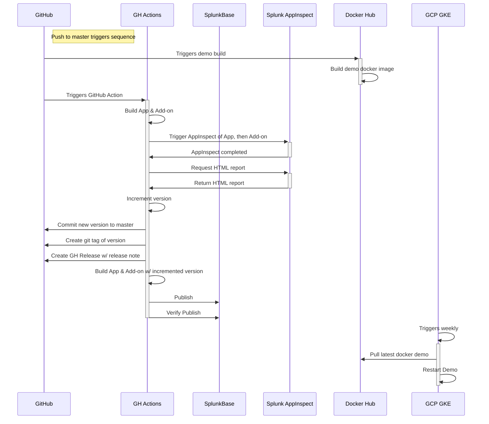

# all-the-tests

<img src="https://mermaid.ink/svg/eyJjb2RlIjoic2VxdWVuY2VEaWFncmFtXG4gIHBhcnRpY2lwYW50IEdpdEh1YlxuICBub3RlIHJpZ2h0IG9mIEdpdEh1YjogUHVzaCB0byBtYXN0ZXIgdHJpZ2dlcnMgc2VxdWVuY2VcbiAgcGFydGljaXBhbnQgR0ggQWN0aW9uc1xuICBwYXJ0aWNpcGFudCBTcGx1bmtCYXNlXG4gIHBhcnRpY2lwYW50IFNwbHVuayBBcHBJbnNwZWN0XG4gIHBhcnRpY2lwYW50IERvY2tlciBIdWJcbiAgcGFydGljaXBhbnQgR0NQIEdLRVxuXG4gIEdpdEh1Yi0-PitEb2NrZXIgSHViOiBUcmlnZ2VycyBkZW1vIGJ1aWxkXG4gIERvY2tlciBIdWItPj4tRG9ja2VyIEh1YjogQnVpbGQgZGVtbyBkb2NrZXIgaW1hZ2VcbiAgXG4gIEdpdEh1Yi0-PitHSCBBY3Rpb25zOiBUcmlnZ2VycyBHaXRIdWIgQWN0aW9uXG4gIEdIIEFjdGlvbnMtPj5HSCBBY3Rpb25zOiBCdWlsZCBBcHAgJiBBZGQtb25cbiAgR0ggQWN0aW9ucy0-PitTcGx1bmsgQXBwSW5zcGVjdDogVHJpZ2dlciBBcHBJbnNwZWN0IG9mIEFwcCwgdGhlbiBBZGQtb25cbiAgU3BsdW5rIEFwcEluc3BlY3QtPj4tR0ggQWN0aW9uczogQXBwSW5zcGVjdCBjb21wbGV0ZWRcbiAgR0ggQWN0aW9ucy0-PitTcGx1bmsgQXBwSW5zcGVjdDogUmVxdWVzdCBIVE1MIHJlcG9ydFxuICBTcGx1bmsgQXBwSW5zcGVjdC0-Pi1HSCBBY3Rpb25zOiBSZXR1cm4gSFRNTCByZXBvcnRcbiAgR0ggQWN0aW9ucy0-PkdIIEFjdGlvbnM6IEluY3JlbWVudCB2ZXJzaW9uXG4gIEdIIEFjdGlvbnMtPj5HaXRIdWI6IENvbW1pdCBuZXcgdmVyc2lvbiB0byBtYXN0ZXJcbiAgR0ggQWN0aW9ucy0-PkdpdEh1YjogQ3JlYXRlIGdpdCB0YWcgb2YgdmVyc2lvblxuICBHSCBBY3Rpb25zLT4-R2l0SHViOiBDcmVhdGUgR0ggUmVsZWFzZSB3LyByZWxlYXNlIG5vdGVcbiAgR0ggQWN0aW9ucy0-PkdIIEFjdGlvbnM6IEJ1aWxkIEFwcCAmIEFkZC1vbiB3LyBpbmNyZW1lbnRlZCB2ZXJzaW9uXG4gIEdIIEFjdGlvbnMtPj5TcGx1bmtCYXNlOiBQdWJsaXNoXG4gIEdIIEFjdGlvbnMtPj5TcGx1bmtCYXNlOiBWZXJpZnkgUHVibGlzaFxuICBkZWFjdGl2YXRlIEdIIEFjdGlvbnNcbiAgXG5cdEdDUCBHS0UtPj4rR0NQIEdLRTogVHJpZ2dlcnMgd2Vla2x5XG4gIEdDUCBHS0UtPj5Eb2NrZXIgSHViOiBQdWxsIGxhdGVzdCBkb2NrZXIgZGVtb1xuICBHQ1AgR0tFLT4-LUdDUCBHS0U6IFJlc3RhcnQgRGVtbyIsIm1lcm1haWQiOnsidGhlbWUiOiJkZWZhdWx0IiwidGhlbWVWYXJpYWJsZXMiOnsiYmFja2dyb3VuZCI6IndoaXRlIiwicHJpbWFyeUNvbG9yIjoiI0VDRUNGRiIsInNlY29uZGFyeUNvbG9yIjoiI2ZmZmZkZSIsInRlcnRpYXJ5Q29sb3IiOiJoc2woODAsIDEwMCUsIDk2LjI3NDUwOTgwMzklKSIsInByaW1hcnlCb3JkZXJDb2xvciI6ImhzbCgyNDAsIDYwJSwgODYuMjc0NTA5ODAzOSUpIiwic2Vjb25kYXJ5Qm9yZGVyQ29sb3IiOiJoc2woNjAsIDYwJSwgODMuNTI5NDExNzY0NyUpIiwidGVydGlhcnlCb3JkZXJDb2xvciI6ImhzbCg4MCwgNjAlLCA4Ni4yNzQ1MDk4MDM5JSkiLCJwcmltYXJ5VGV4dENvbG9yIjoiIzEzMTMwMCIsInNlY29uZGFyeVRleHRDb2xvciI6IiMwMDAwMjEiLCJ0ZXJ0aWFyeVRleHRDb2xvciI6InJnYig5LjUwMDAwMDAwMDEsIDkuNTAwMDAwMDAwMSwgOS41MDAwMDAwMDAxKSIsImxpbmVDb2xvciI6IiMzMzMzMzMiLCJ0ZXh0Q29sb3IiOiIjMzMzIiwibWFpbkJrZyI6IiNFQ0VDRkYiLCJzZWNvbmRCa2ciOiIjZmZmZmRlIiwiYm9yZGVyMSI6IiM5MzcwREIiLCJib3JkZXIyIjoiI2FhYWEzMyIsImFycm93aGVhZENvbG9yIjoiIzMzMzMzMyIsImZvbnRGYW1pbHkiOiJcInRyZWJ1Y2hldCBtc1wiLCB2ZXJkYW5hLCBhcmlhbCIsImZvbnRTaXplIjoiMTZweCIsImxhYmVsQmFja2dyb3VuZCI6IiNlOGU4ZTgiLCJub2RlQmtnIjoiI0VDRUNGRiIsIm5vZGVCb3JkZXIiOiIjOTM3MERCIiwiY2x1c3RlckJrZyI6IiNmZmZmZGUiLCJjbHVzdGVyQm9yZGVyIjoiI2FhYWEzMyIsImRlZmF1bHRMaW5rQ29sb3IiOiIjMzMzMzMzIiwidGl0bGVDb2xvciI6IiMzMzMiLCJlZGdlTGFiZWxCYWNrZ3JvdW5kIjoiI2U4ZThlOCIsImFjdG9yQm9yZGVyIjoiaHNsKDI1OS42MjYxNjgyMjQzLCA1OS43NzY1MzYzMTI4JSwgODcuOTAxOTYwNzg0MyUpIiwiYWN0b3JCa2ciOiIjRUNFQ0ZGIiwiYWN0b3JUZXh0Q29sb3IiOiJibGFjayIsImFjdG9yTGluZUNvbG9yIjoiZ3JleSIsInNpZ25hbENvbG9yIjoiIzMzMyIsInNpZ25hbFRleHRDb2xvciI6IiMzMzMiLCJsYWJlbEJveEJrZ0NvbG9yIjoiI0VDRUNGRiIsImxhYmVsQm94Qm9yZGVyQ29sb3IiOiJoc2woMjU5LjYyNjE2ODIyNDMsIDU5Ljc3NjUzNjMxMjglLCA4Ny45MDE5NjA3ODQzJSkiLCJsYWJlbFRleHRDb2xvciI6ImJsYWNrIiwibG9vcFRleHRDb2xvciI6ImJsYWNrIiwibm90ZUJvcmRlckNvbG9yIjoiI2FhYWEzMyIsIm5vdGVCa2dDb2xvciI6IiNmZmY1YWQiLCJub3RlVGV4dENvbG9yIjoiYmxhY2siLCJhY3RpdmF0aW9uQm9yZGVyQ29sb3IiOiIjNjY2IiwiYWN0aXZhdGlvbkJrZ0NvbG9yIjoiI2Y0ZjRmNCIsInNlcXVlbmNlTnVtYmVyQ29sb3IiOiJ3aGl0ZSIsInNlY3Rpb25Ca2dDb2xvciI6InJnYmEoMTAyLCAxMDIsIDI1NSwgMC40OSkiLCJhbHRTZWN0aW9uQmtnQ29sb3IiOiJ3aGl0ZSIsInNlY3Rpb25Ca2dDb2xvcjIiOiIjZmZmNDAwIiwidGFza0JvcmRlckNvbG9yIjoiIzUzNGZiYyIsInRhc2tCa2dDb2xvciI6IiM4YTkwZGQiLCJ0YXNrVGV4dExpZ2h0Q29sb3IiOiJ3aGl0ZSIsInRhc2tUZXh0Q29sb3IiOiJ3aGl0ZSIsInRhc2tUZXh0RGFya0NvbG9yIjoiYmxhY2siLCJ0YXNrVGV4dE91dHNpZGVDb2xvciI6ImJsYWNrIiwidGFza1RleHRDbGlja2FibGVDb2xvciI6IiMwMDMxNjMiLCJhY3RpdmVUYXNrQm9yZGVyQ29sb3IiOiIjNTM0ZmJjIiwiYWN0aXZlVGFza0JrZ0NvbG9yIjoiI2JmYzdmZiIsImdyaWRDb2xvciI6ImxpZ2h0Z3JleSIsImRvbmVUYXNrQmtnQ29sb3IiOiJsaWdodGdyZXkiLCJkb25lVGFza0JvcmRlckNvbG9yIjoiZ3JleSIsImNyaXRCb3JkZXJDb2xvciI6IiNmZjg4ODgiLCJjcml0QmtnQ29sb3IiOiJyZWQiLCJ0b2RheUxpbmVDb2xvciI6InJlZCIsImxhYmVsQ29sb3IiOiJibGFjayIsImVycm9yQmtnQ29sb3IiOiIjNTUyMjIyIiwiZXJyb3JUZXh0Q29sb3IiOiIjNTUyMjIyIiwiY2xhc3NUZXh0IjoiIzEzMTMwMCIsImZpbGxUeXBlMCI6IiNFQ0VDRkYiLCJmaWxsVHlwZTEiOiIjZmZmZmRlIiwiZmlsbFR5cGUyIjoiaHNsKDMwNCwgMTAwJSwgOTYuMjc0NTA5ODAzOSUpIiwiZmlsbFR5cGUzIjoiaHNsKDEyNCwgMTAwJSwgOTMuNTI5NDExNzY0NyUpIiwiZmlsbFR5cGU0IjoiaHNsKDE3NiwgMTAwJSwgOTYuMjc0NTA5ODAzOSUpIiwiZmlsbFR5cGU1IjoiaHNsKC00LCAxMDAlLCA5My41Mjk0MTE3NjQ3JSkiLCJmaWxsVHlwZTYiOiJoc2woOCwgMTAwJSwgOTYuMjc0NTA5ODAzOSUpIiwiZmlsbFR5cGU3IjoiaHNsKDE4OCwgMTAwJSwgOTMuNTI5NDExNzY0NyUpIn19LCJ1cGRhdGVFZGl0b3IiOmZhbHNlfQ" />

